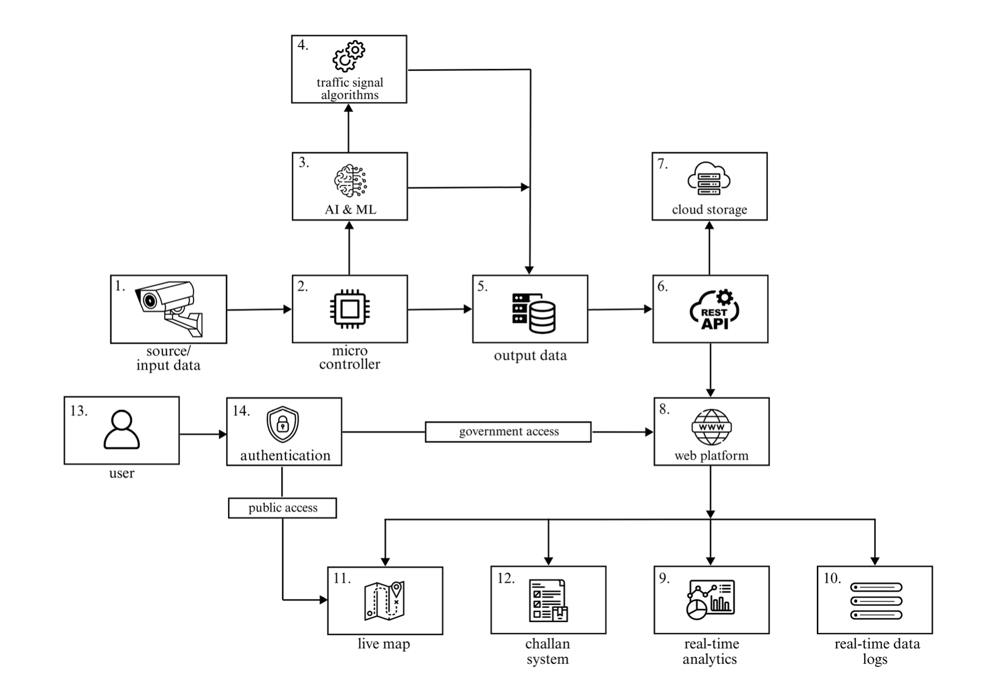

# 🚦 Smart Traffic Control & Surveillance System

A real-time, AI-powered traffic control and surveillance platform integrating Computer Vision, Edge Computing, and Cloud Technology to solve modern urban traffic challenges.

---

## 🧠 Problem Statement

Urban areas today suffer from:
- Severe traffic congestion
- Frequent traffic violations (helmet-less riding, red light jumping, overspeeding)
- Delayed emergency response
- Ineffective and outdated traffic control systems

Traditional traffic systems use static timers and lack the intelligence to adapt in real-time. Manual enforcement is inefficient and resource-intensive, while the absence of centralized violation data makes tracking offenders difficult.

---

## ✅ Approach & Solution

We propose an **intelligent traffic control and surveillance system** using:
- **Edge computing** on Raspberry Pi with live camera feeds
- **YOLO11 ML model** for vehicle detection and classification
- **Helmet, speed, ANPR, and red light violation detection**
- **Emergency vehicle detection and automatic signal prioritization**
- **Cloud storage** of surveillance data (images, license plates, logs)
- **Web-based dashboard** for real-time analytics and enforcement

All data is processed in real-time, securely stored on Google Cloud, and made accessible to authorities through an advanced, role-based authentication system.

---

## ✨ Features

- 🚦 **Dynamic traffic signal control** based on real-time vehicle density  
- 🚑 **Automatic emergency vehicle prioritization**  
- 📸 **Vehicle detection with classification (bike, car, truck, etc.)**  
- 🪖 **Helmet detection**  
- 🛑 **Red light violation detection**  
- 🚓 **Speed detection & automatic number plate recognition (ANPR)**  
- 📡 **Real-time data sync via RESTful APIs to cloud and web dashboard**  
- 🔍 **Searchable logs by license number, location, date, etc.**  
- 📊 **Live maps, heatmaps, analytics graphs for traffic & violations**  
- 🧾 **Automatic challan generation with violation proof**  
- 🔐 **Advanced 3-level authentication for government users**  

---

## 🧰 Tech Stack

| Layer         | Tools/Technologies Used |
|---------------|-------------------------|
| **Frontend**  | React, Next.js, Angular, Google Maps API |
| **Backend**   | Node.js, Express.js, RESTful APIs |
| **AI/ML**     | Custom YOLOv11, OpenCV, EasyOCR, Google Vision API |
| **Hardware**  | Raspberry Pi, Camera Modules |
| **Cloud**     | Google Cloud Platform (GCP), Google Cloud Storage, Compute Engine |
| **Dev Tools** | Docker, Google Colab, SQL |

---
## System Architecture
 
## 🖼️ Screenshots

> *(Include your actual screenshots in your repo’s `/screenshots` folder and reference them here)*

| Dashboard | Live Map |
|----------|----------|
|  |  |

| Violation Detection | License Plate Logs |
|---------------------|--------------------|
|  |  |

---

## 🚀 Run Instructions

### ⚙️ Prerequisites
- Node.js
- Python 3.x
- Raspberry Pi (for hardware-side setup)
- Google Cloud credentials & API access (Vision API, GCP bucket)

### 🖥️ Backend Setup

```bash
cd backend
npm install
npm start
